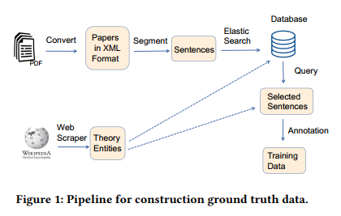
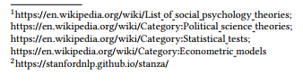
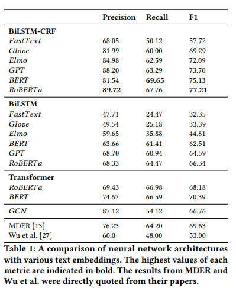

- 他们的代码还公开出来了
- https://github.com/lampslab/theory
- we propose an automated framework based on distant supervision that leverages entity mentions from Wikipedia to build a ground truth corpus consisting of more than 4500 automatically annotated sentences containing **theory/model mentions**.
- 这篇文章是说他们只抽取社会科学领域的理论和模型
- The framework automatically generates annotated text based on seed entity names adopted from Wikipedia, which mitigates the data scarcity problem in neural NER models
- 他们这个远程监督最大的特点就是从维基百科去拿理论和模型的种子词
- We use this corpus to train models for theory extraction in SBS papers. We compared four
  deep learning architectures and found the **RoBERTa-BiLSTM-CRF** is the best one with a precision as high as** 89.72%**. The model is promising to be conveniently extended to domains other than SBS
- 他们利用远程监督构建标注数据的流程
- 
- Web Scraping
	- The final seed list is comprised of 550 unique theory names.
	- 维基百科这个真的挺好使的
	- 
- Obtaining Body Text
	- GROBID [15] is a machine learning library for extracting and re-structuring raw documents
- Sentence Segmentation
	- We use **Stanza2** to segment the body text of papers into sentences. We extracted in total of 870,000 sentences from the 2400 papers.
- Elasticsearch
	- providing full-text search with a web interface. It uses **BM25** as the default retrieval model
	- 这个是全文搜索引擎，用来搜索包含了前面建立好的实体在论文全文中出现的地方
- Automatic Annotation
	- The seed theory mentions obtained in Web Scraping are used to query the Elasticsearch index. Finally, we obtained 4534 sentences as the ground truth.
- 下面这个是几个抽取模型的效果对比图，不同的模型配上不同的种类的embedding做了一系列的对比
- 
- Under the BiLSTM-CRF architecture, the transformer-based word embedding models such as BERT, RoBERTa, and GPT achieves superior performance compared with other word embedding models
- Human supervision only occurs when compiling the seed theory names by first selecting Wikipedia webpages and excluding unqualified terms using a heuristic filter
- 最后总体的实验效果显示还是可以的，模型确实学到了一定的泛化能力，抽取了一些未在训练集中出现的模型和理论