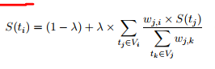

- 关键词和关键短语的抽取主流的有两种做法，监督式的和非监督式的，尽管监督式的效果较好，但是他收到标注语料和标注领域的限制，领域迁移性很弱
- While supervised approaches have generally proven to be more successful, the need for training data and the bias towards the domain on which they are trained remain two critical issues
- 他这个graph based ranking的方式和其他的人稍微不同的点是，每个点代表了一个类，每个类中包含了好几个相似的短语，然后计算类间距离作为边的权重，然后选取关键短语的时候，从每个类中选取一个最具有代表性的
- 
-
  >聚合相似短语，生成文章主题
- We follow Wan and Xiao (2008) and extract the longest sequences of nouns and adjectives from the document as keyphrase candidates
- we propose to group similar noun phrases as a single entity, a topic.这个主题的定义很不准确，就是把相似的短语定义为1个主题，不过什么是主题好像确实不太好定义
- 短语的相似度计算方法就是他们的相同的字符的个数，这个还对字符做了词干换原
- We consider that two keyphrase candidates are similar if they have at least 25% of overlapping words. Keyphrase candidates are stemmed to reduce their inflected word forms into root forms.
- 使用聚类算法，聚合相似的短语
- To automatically group similar candidates into topics, we use a Hierarchical Agglomerative Clustering (HAC) algorithm. Among the commonly used linkage strategies, which are complete, average and single linkage, we use the average linkage, because it stands as a compromise between complete and single linkage.
-
  >graph based ranking
- topics are vertices and edges are weighted according to the strength of the semantic relations between vertices.
- 主题 i and 主题 j have a strong semantic relation if their keyphrase candidates often appear close to each other in the document.下面是两个主题的边的权重的计算公式
- 
- 图构建好了之后，就可以做pagerank式的计算了
- 
- keyphrase selection
- For each topic, only the most representative keyphrase candidate is selected.  This selection avoids redundancy and leads to a good coverage of the document topics, because extracting k keyphrases precisely covers k topics.
- 他这里采用了三种选择策略
- 第一种是选择在文中第一次出现是比较靠近文章前面的
- 第二种是在文中出现次数比较多的
- 第三种是距离子类中其他短语距离比较近的