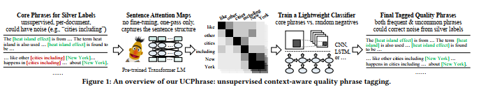
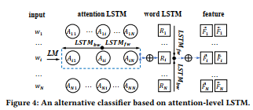
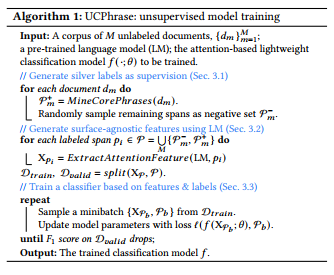

title:: UCPhrase: Unsupervised Context-aware Quality Phrase Tagging

- 这篇论文的创新点是想到了用统计性的特征作为标签来做训练集训练tagging based model,最后发现效果好像还行，就是收集高频出现的短语作为高质量的短语，然后使用 bert-based的model中的attention maps feature matrix做为特征来预测phrase span，这样可以非常有效的防止过拟合，思路挺好的，效果也还行
- 论文中的高频短语是针对单篇文献而言，也就是说并不是在一系列文档中高频，他才高频，他只需要在一篇文章中出现次数超过2且长度最长的短语，他是单篇文档单篇文档统计的，然后再根据停用词去掉一些噪声短语，就得到了高质量的标注短语了
- 作者说他这篇文章主要针对的点是以前的Autophrase对统计特征有约束，这会过滤掉论文中新出现的短语，单着这篇文章中提出的方法能有效的预测**infrequent phrase**
- 这篇文章主要的启发来自于以前的研究指出，Bert类模型对做句子依存分析，phrase-chunking效果非常好
- [[Are pretrained language model aware of Phrases? Simple but Strong Baselines for grammmar induction, 2019]]
- 
- 
- 
- 文章最后这里是使用了两种类型分类器
- 一种是把他作为图像，使用CNN来作为分类器
- 一种是使用LSTM，来分类，
- 最后实验结果显示两种方式差别不大
-
-
-
-
-
-
-
-