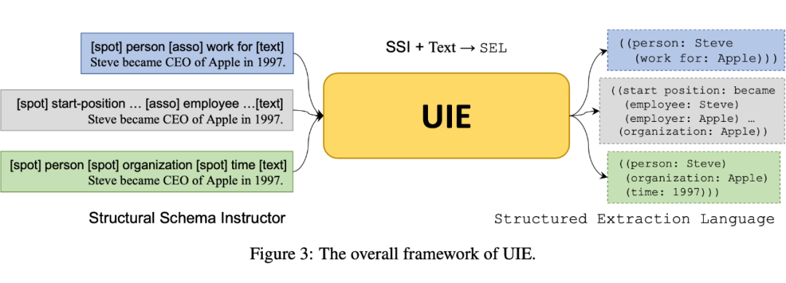

- https://github.com/PaddlePaddle/PaddleNLP/tree/develop/model_zoo/uie
- 针对上述问题，文章做了如下贡献：
	- 设计了一种结构化抽取语言（Structural Extraction Language, SEL），它能够将四种信息抽取任务的不同结构统一描述，使得模型的输出结构针对不同任务都是一致的。
	- 由于模型可以做多个任务，所以需要一种方式去指导模型做指定的任务，因此作者设计了结构化模式指导器（Structural Schema Instructor, SSI），其实这就是一种 prompt。
	- 由于模型的输出都是符合 SEL 语法的结构化信息，而目前常用的生成式预训练模型如 T5、BART 都是以生成自然语言为主，若直接采用这种预训练模型会影响到模型性能，因此作者专门针对 text to structure 的结构来预训练了一个大模型。
-
- 作者采用生成式 text to structure 结构统一了信息抽取的四个任务，并且在 13 个数据集上采用全监督、低资源和少样本设置下均取得了 SOTA。
- https://arxiv.org/abs/2203.12277
- 采用 SEL 和 SSI 来统一化建模信息抽取任务。
- 实验结果表明，本文提出的统一生成框架，基于T5模型进行了IE预训练，在**实体、关系、事件和情感**等4个信息抽取任务、13个数据集的全监督、低资源和少样本设置下均取得了SOTA性能。
- 统一信息抽取任务输出结构的结构化抽取语言**SEL**
- 指导模型做特定任务的结构化模式指导器**SSI**
	- 作者提出了 SSI（Structural Schema Instructor），是一种基于 Schema 的 prompt。当我们输入句子时，在句子前面拼接上对应的 Prompt，即可让模型做对应的任务。
	- 不同任务的的形式是：
		- 实体抽取：[spot] 实体类别 [text]
		  关系抽取：[spot] 实体类别 [asso] 关系类别 [text]
		  事件抽取：[spot] 事件类别 [asso] 论元类别 [text]
		  观点抽取：[spot] 评价维度 [asso] 观点类别 [text]
- 
-
  >预训练与微调
- 这一节将介绍 UIE 是如何预训练的，以及如何将其应用于下游任务去微调。作者采用的模型是 T5-v1.1-base 和 T5-v1.1-large 作为 UIE-base 和 UIE-large，模型的参数初始化直接使用了 T5-v1.1 的参数，也就是说直接基于其进行了二次预训练。
-
-
-