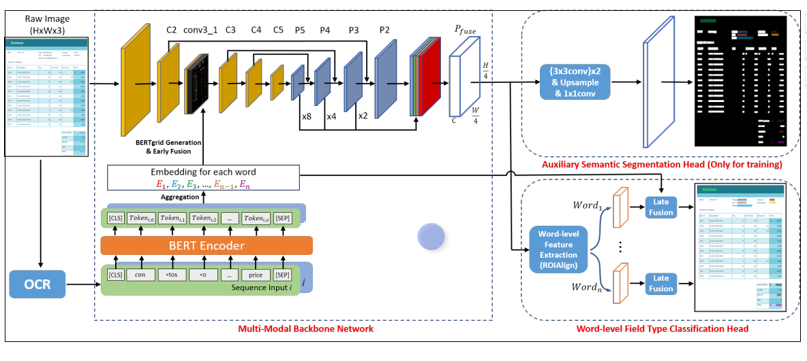

title:: ViBERTgrid: A Jointly Trained Multi-Modal 2D Document Representation for Key Information Extraction from Documents

- According to their used document representation methods, these approaches could be roughly categorized into three types:
	- sequence-based
	- graph-based
	- grid-based
- {:height 324, :width 704}
- BERTgrid Generation
	- these words are then organized as a unidimensional sequence of length N , denoted as D =(w(&), w()), ⋯ , w(+)), by reading them in a top-left to bottom-right order.
	- as the maximum input sequence length of BERT is restricted to 512, we use a sliding window to slice long sequences (with a length greater than 510) into several fixed-length subsequences whose lengths are set to 510. Neighboring subsequences are not overlapped with each other.
- 他这个encode text segment的方式是直接按照顺序直接拼接起来，超过512的就直接截断
-