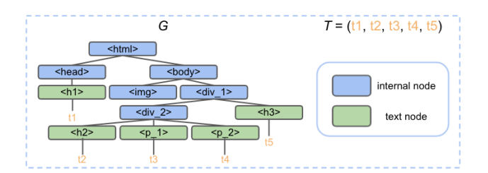

- In this paper, we introduce WebFormer,
- First, we design HTML tokens for each DOM node in the HTML by embedding representations from their neighboring tokens through **graph attention**.
- Second, we construct rich attention patterns between HTML tokens and text tokens, which leverages the web layout for effective attention weight computation.
- The web document is first processed into a sequence of text nodes and the HTML DOM
  tree. We denote the text sequence from the web document as 𝑇 = (𝑡1, 𝑡2, . . . , 𝑡𝑘 ), where 𝑡𝑖 represents the 𝑖-𝑡ℎ text node on the web. 𝑘 is the total number of text nodes with 𝑡𝑖=(𝑤𝑖1
  ,𝑤𝑖2, . . . ,𝑤𝑖𝑛𝑖 ) as its 𝑛𝑖 words/tokens. Note that the ordering of the text nodes does
  not matter in our model, and one can traverse the DOM tree in any order to obtain all the text nodes
- Denote the DOM tree of the HTML as 𝐺 = (𝑉 , 𝐸), where 𝑉 is the set of DOM nodes in the tree with 𝐸 being the set of edges.
- The goal of structure information extraction is that given a set of target fields 𝐹=(𝑓1, . . . , 𝑓𝑚), extract their corresponding text information from the web document.
- 
-
  > Input Layer
	- Field token: A set of field tokens are used to represent the text field to be extracted, such as “title”, “company” and “base salary” for a job page.
	- HTML token: Each node in the DOM tree 𝐺, including both internal nodes (non-text node) and text nodes, corresponds to an HTML token in WebFormer
	- Text token
- for field and text tokens, their final embeddings are achieved by concatenating a word embedding and a segment embedding. For HTML token embedding, they are formulated by concatenating a tag embedding and a segment embedding.The segment embedding is added to indicate which type the token belongs to, i.e. field, HTML or text. The tag embedding is introduced to represent different HTML-tag of the DOM nodes,
  e.g. “𝑑𝑖𝑣”, “ℎ𝑒𝑎𝑑”, “ℎ1”, “𝑝”, etc.
-
  > WebFormer Encoder
	- The WebFormer encoder is **a stack of 𝐿 identical contextual layers**, which efficiently connects the field, HTML and text tokens with rich attention patterns followed by a feed-forward network.
		- To capture the complex HTML layout with the text sequence, we design four different attention patterns, including
		  1) HTML-to-HTML (H2H) attention which models the relations among HTML tokens via graph attentions. We use the original graph 𝐺 that represents the DOM tree structure of the HTML in the H2H attention calculation. In addition, we add edges to connect the sibling nodes in the graph, which is equivalent to include certain neighbors with edge distance 2 in the graph.
		- 2) HTML-to-Text (H2T) attention, which bridges the HTML token with its corresponding
		  text tokens. We adopt a full attention pattern where the HTMLtoken 𝑥𝐻𝑖 is able to attend to each of its text tokens 𝑥𝑇𝑗 in tj
		- 3) Text-to-HTML (T2H) attention that propagates the information from the HTML tokens to the text tokens. In T2H attention, each text token communicates with every HTML token.
		- 4) Text-to-Text (T2T) attention with relative position representations. Each text token only attends to the text tokens within the same text sequence and within a local radius.
		- Field Token Attention  enable full cross-attentions between field and HTML tokens
- {:height 397, :width 704}
- 
-
  > The output layer
- The output layer of WebFormer extracts the final text span for the field from the text tokens. We apply a softmax function on the output embeddings of the encoder to **generate the probabilities for the begin and end indices**
- 
- we further predict the end index based on the start index by concatenating the begin token embedding with every token embedding after it.
-
  > implementation detail
- we use open-source LXML library3 to process each page for obtaining the DOM tree structures. We then use in order traverse of the DOM tree to obtain the text nodes
  sequence. The parameters used in WebFormer are 12 layers, 768 hidden size, 3072
  hidden units (for FFN) and 64 local radius. The maximum text sequence length is set to 2048
#### Zero-shot/Few-shot Extraction
- 
- 这个计算方式和bigbird的方式有点像的，也是用block的方式，计算复杂度也是O(3n),然后对于全局的token,他的计算方式是直接concat到3*blocksize 的后面，这样计算也挺好的，复杂度应该还是线性复杂度
- 在t2t和t2h的attention中，这两个是合并在一起计算的，html是作为sidekey输入进去的
- 计算h2t和h2h的时候，论文是直接用的普通的O(n*n)的复杂度方式计算的，只不过里面有一个relative edge需要额外计算一下，并加起来
- 这个计算relative position score的方式是先和embedding table 计算，再gather
-
  >代码注释
- 他这个代码和那个bigbird的代码很像，对于T2T和T2H他是放到一个计算框架里的，就是T2T是按照标准的local attention来计算的，然后那个T2H是作为side input concate到block上面的，
- 他这个部署了两种local attentiond的方式，一种是O(3n)-qkvrelativelocalattention的方式，一种是O(n*n)的方式，这个O(3n)最终的计算也是会转换到o(n*n)的计算上去，只不过是以blocksize作为sequence length的方式
- 然后对于H2T和H2H作者直接是用了O(n*n)的方式去实现的，就没用那种block的方式，就是直接把两种key和value拼接到一起
- 那个relative id的计算也是在qkvrelativeattention类中实现的，就是用一种gather的方式实现的,先把整个q和relative id embedding计算然后再gather