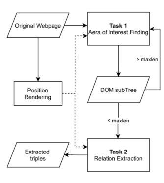
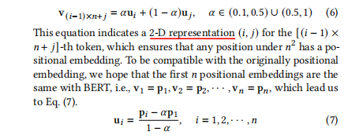
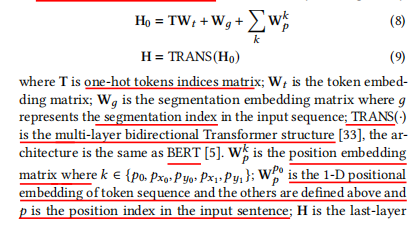
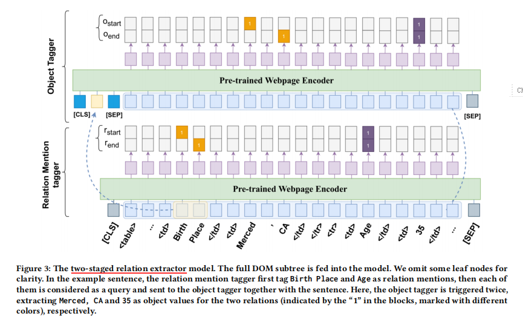

title:: WebKE: Knowledge Extraction from Semi-structured Web with Pre-trained Markup Language Model

- https://github.com/redreamality/webke.
- we propose a pipelined extraction framework to handle the semi-structured web content. Our solution is based on BERT
- Given a webpage 𝑤 ∈ W describing a subject entity 𝑠 (also called topic entity in previous literature),our goal is to extract ⟨𝑟, 𝑜⟩ pairs to form a relational triple..
- Depending on whether the relations are predefined, there exist two settings, i.e., ClosedIE and OpenIE. we adopt **OpenIE**, where the relation is also expected to be extracted
- It processes the web content on different granularity by first detecting areas of interest at DOM tree node level and then extracting relational triples for each area.
- We adopt the **distant supervision setting**. To reduce the impact of false negatives in distant supervision, we propose a novel relation extractor that identifies relation mentions first and then find the objects for each relation. This approach generates abundant training data with small effort.
- 
-
- We regard the input DOM (sub)tree as a sequence of tokens t.
-
  >HTMLBERT: Pre-trained Webpage Encoder
	- **Extended Vocabulary**: HTML tags (e.g., <a>, <table>, <tr>)contribute a lot to the web structure, which is essential for extraction.
	- **Extended Positional Embeddings**: we develop a hierarchical positional embedding that extend the original positional embedding of BERT. We obtain pre-trained position embedding vectors p = [𝑝1, 𝑝2, ..., 𝑝𝑛] from BERT. Our aim is to construct a series of
	  new embedding vectors v = [𝑣1, 𝑣2, ..., 𝑣𝑚],𝑚 > 𝑛, so that more positions can be represented. Therefore, we introduce a vector basis u = [𝑢1, 𝑢2, ..., 𝑢𝑛] for v. Their connection is defined by
		- 
		- 他就是把原来的n个位置扩充到了n的平方个位置
	- **Layout Embeddings**: we render the webpage using headless chrome5 and record the position of elements by selenium (𝑝𝑥0, 𝑝𝑦0, 𝑝𝑥1, 𝑝𝑦1 )
	- Hidden Layers and Pre-training
	- 
	- We pre-train the webpage encoder via the standard “masked language model" and
	  “next sentence prediction" tasks. The **SWDE corpus** we used for pre-training
-
  >Task 1: Area of Interest (AOI) Finding
	- We define an area as a node together with its child node(s) and the length of area as the length of all the tokens in the area. The area is of interest if it contains information fields (see Figure 1) for further knowledge extraction.
	- At a certain level 𝑘, we form a sequence of tokens n𝑘 ⊂ t using only the nodes at 𝑘-th layer (their child nodes excluded) and use a machine reading comprehension (MRC) [2] model to decide which node(s) at this level contain(s) information fields for further knowledge extraction
	- We perform preprocessing by moving out the properties from inside the HTML tags to the outside, which make it easier for BERT tokenizer to recognize the HTML tags as a whole while retaining the signals provided by the properties.
	- This process is recursively applied until the length of an area is smaller than maximum length 𝑀 of subsequent models or none of the area in the current branch is of interest
-
  >Task 2: Relation Extraction
- {:height 441, :width 704}
- The first model tags the start/end positions of the relation mentions, which are fed one by one into the second model as queries to tag the start/end positions of the objects
- The input of the relation mention tagger is x𝑟 =\[[CLS], t𝑖, [SEP]],
- The input of the object tagger is slightly different, which is x𝑜 = \[[CLS], q𝑖, [SEP], t𝑖, [SEP]]. q𝑖 is formed by the relation mention extracted above
-
-
-
-