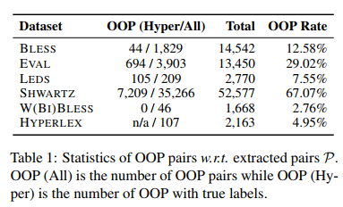

title:: When Hearst Is not Enough: Improving Hypernymy Detection from Corpus with Distributional Models

- 这篇文章是香港科技大学的，看着好像还挺厉害的
- 这篇文章中将hearst pattern产生的稀疏性问题归为了两类
	- type I 两个词出现在不同的抽取的上下位关系对中，但是他们没有在一起被抽到过
	- Type II 两个词没有出现在任何已被抽取的关系对中，这篇文章就是重点来解决这一类稀疏性问题的
- 这篇文章也是把hearst pattern和distributional based model结合起来，也就是先用hearst pattern去抽取一部分上下位关系词作为训练语料
- 然后再用神经网络模型去预测没有共现关系的词之间的关系
- 这篇文章里面是采用了4个模型
	- Transformed word vector
	- NBoW with Mean-Pooling
	- Context2VEct with Mean-pooling
	- Hierarchical Attention Networks
- 用hearst模式抽取的结果去训练上面的四个模型，
- 
- 这个是这个论文中用到的数据集0
-