- https://github.com/LIAAD/yake
- 这篇文章使用无监督的方式抽取每篇文章中的关键词
- Our system does not need to be trained on a particular set of documents, nor does it depend on dictionaries, external corpora, text size, language, or domain.
- 这篇文章还与其余10中无监督的方式抽取方法和一种有监督式的抽取方法做了对比，证明了方法的有效性
- we compare it against ten state-of-the-art unsupervised approaches and one supervised method. Experimental results carried out on top of twenty datasets show that YAKE! significantly outperforms other unsupervised methods on texts of different sizes, languages, and domains
- 这篇文章只需要维护一个停用词表就够了
- 这篇文章还有一个特点是对关键词的频率没做任何的限制
- >模型主要步骤
- (1) **text pre-processing and candidate term identification**;这步主要就是分词，他这个分词的时候给每个token增加了一个标记，如下面是数字或者数字和字符混合的那种
	- 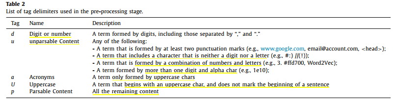
	- 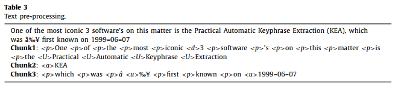
-
- (2) feature extraction;
	- a set of five features likely to capture the nature of each candidate term, where a candidate term is a 1-gram token
		- **TCase** (line 2), 这个词是否大写
			- 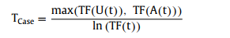
		- **TPos** (line 3),这个词出现的位置，这个词出现的句子所在的位置的集合的平均数
			- 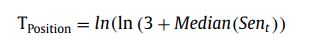
		- **TFNorm** (lines 4–7),词出现的频率，思想是一篇文章中，某个词出现的次数越多，这个词越重要，底下的分母是为了抵消文章长度的影响
			- 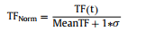
		- **TRel** (lines 9–13),we describe a statistical feature which aims to determine the dispersion (D) of a candidate term t with regards to its specific context. We rely on the assumption of Machado et al. (2009) [29] who state that the higher the number of different terms that co-occur with the candidate term t on both sides, the less significant term t will be. DL [DR] is formalized in
			- 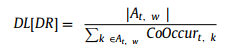
			- 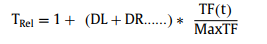
		- **TSent** (line 14). This feature quantifies how often a candidate term appears within different sentences. It reflects the assumption that candidates which appear in many different sentences have a higher probability of being important.
			- 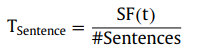
			- 这个就是term t出现的句子的总数除以一篇文章中所有的句子的总数
	- In our approach, we give extra attention to any term beginning with a capital letter (excluding the beginning of sentences)
- (3) computing term score;这步就是集结上一步计算的5个特征项，the more significant the 1-gram term (t) is.
	- 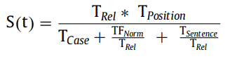
- (4) n-gram generation and computing candidate keyword score;
	- 这步可以分为两个子步
	- 第一小步是遍历序列生成所有可能的n-gram（最大长度为3）,生成n-gram的时候有一些限制条件，比如说开头结尾不能是停用词，During this process we only select as candidate keywords those whose individual terms are tagged (line 7) as acronyms (<a>), uppercase (<U>), or parsable content (
).we assume that relevant keywords rarely begin or end with a stopword。此外，这一步还会记录每个n-gram的频率
	- 第二步就是对这些所有的n-gram进行打分，下面这个是打分的公式，短语中特殊的停用词会有一个特殊的打分公式
	- In order to achieve this goal, we propose a bigram probability approach which rests on the following expression: (1 + (1 − Bigram Probability)), where the Bigram Probability of the stopword token t is given by P(t | ti−1) ∗ P(ti+1 | t).
	-
	- 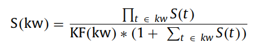
	- we compute the final score by dividing the numerator by the sum of the S(t) scores or BigramProbability scores (in the case of a stopword token), weighted by the candidate
	  keyword frequency KF(kw)
- (5) data deduplication and ranking.这步主要就是去重，把相似性的短语去除掉
	- we aim to learn whether or not removing similar potential candidates improves the
	  ranking results
	- 他这个去重的方法也比较简单，就是把分高的一个一个加入list中，和list已有的相似性很高的就直接丢弃
	- 他提出了三种字符串相似度匹配的方法we make use of three different distance similarity measures
		- the Levenshtein similarity
		- the Jaro-Winkler similarity
		- the sequence matcher
- >对比方法
- The unsupervised approaches include three statistical methods (TF.IDF [22], KP-Miner [13], and RAKE [42]) and seven graph-based methods (TextRank [37], SingleRank [48], ExpandRank [48], TopicRank [4], TopicalPageRank [46], PositionRank [15], and MultipartiteRank [6]). The supervised method is KEA [50]
- 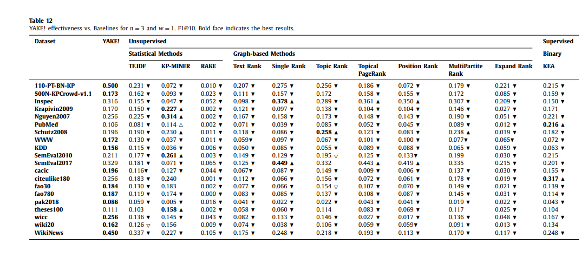