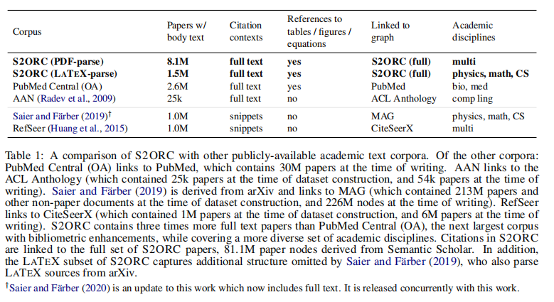

- https://github.com/allenai/s2orc
- 
- S2ORC contains three times more full text papers than PubMed Central (OA), the next largest corpus with bibliometric enhancements, while covering a more diverse set of academic disciplines
- Our corpus covers 136M+ paper nodes with 12.7M+ full text papers and connected by 467M+ citation edges by unifying data from many different sources covering many different academic disciplines and identifying open-access papers using services like Unpaywall.
- 
- https://github.com/allenai/science-parse
- https://github.com/allenai/spv2
- Our evaluations suggest SCIENCEPARSE outperforms GROBID for title and author extraction.
- 