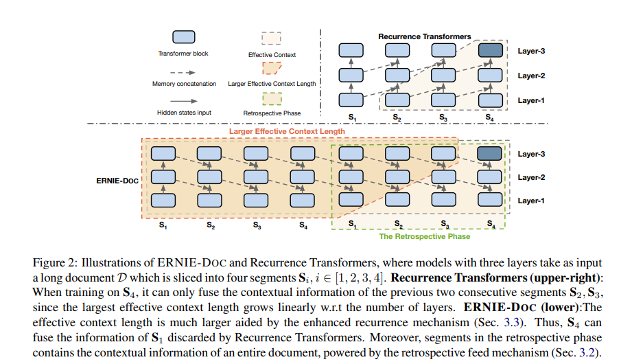

- 
- 这篇文章就是根据recurence transformer改进而来
- ERNIE-DOC builds on the ideas of the Recurrence Transformers to 1) tackle the limitation of Recurrence Transformers for utilizing bidirectional contextual information and 2) improve the behavior of the segment recurrence mechanism to capture longer dependencie
- 就是把文本按照顺序输入两次
- 从上图中可以看到S1的输入中是已经包含了全局信息的，S1能看到前面的S1，S2，S3,S4
- 不过我举得他的这个时间应该会很久
- the function **SG**(·) denotes the stop-gradient operation; and the notation [◦] denotes the concatenation of two hidden states along the length dimension.
- 
-
- 预训练目标函数
	- masked language model (MLM) objective
	- segment-reordering objective for pretraining就是把几个segment顺序打乱，然后预测正确的顺序这个样子
- 
-
-
- D is partitioned into three chunks and then permuted, that is, D = {C1, C2, C3} =⇒ Dˆ = {C2, C3, C1},
  where Ci denotes the i-th chunk. Subsequently, the permuted long context Dˆ is split into T sequential segments as a common practice, denoted as Dˆ = {S1, S2, ..., ST }. We let the pretrained model reorganize these permuted segments, modeled as a K-class classification problem, where K = Pm i=1 i!.
- 提到了几个document level question answering 数据集
- Wikipedia setting of TriviaQA (TQA) (Joshi et al., 2017)
- and distractor setting of HotpotQA (HQA) (Yang et al., 2018))
- 关键短语抽取数据集 OpenKP (Xiong et al., 2019) dataset
-
-
- 下面是一篇关于长文档建模的综述
- [[综述] A survey of Transformers-[9] 分层和并发 - 知乎 (zhihu.com)](https://zhuanlan.zhihu.com/p/463771422)