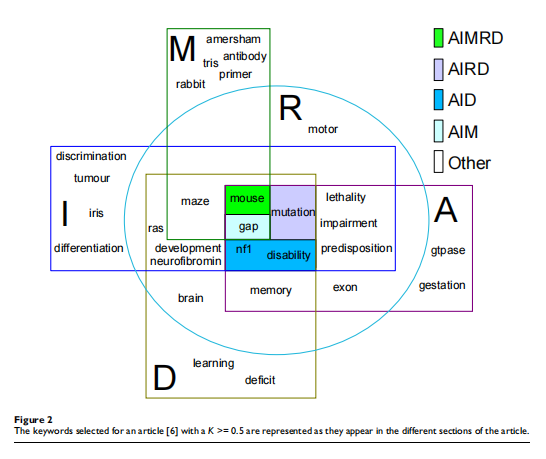

title:: information extraction from full text scientific articles: where are the keywords

- 这篇文章选择关键词的时候，用的是比较简单的策略，就是从论文的section中只选择名词，然后以句子为单位，选择那种和其他名词共现次数较多的词作为关键词
- 这篇文章以医学领域的文章为例，把论文分为abstract, introduction, methods, results, discussion五个部分
- 然后发现五个部分中提取出来的关键词是由差别的，5个部分中只有1到2个词是为5个部分都包含的
- 
- 每个小节中包含了不同类型的信息，其中方法部分包含的信息最多，其中方 0法部分会包含很多细节
-
-
-