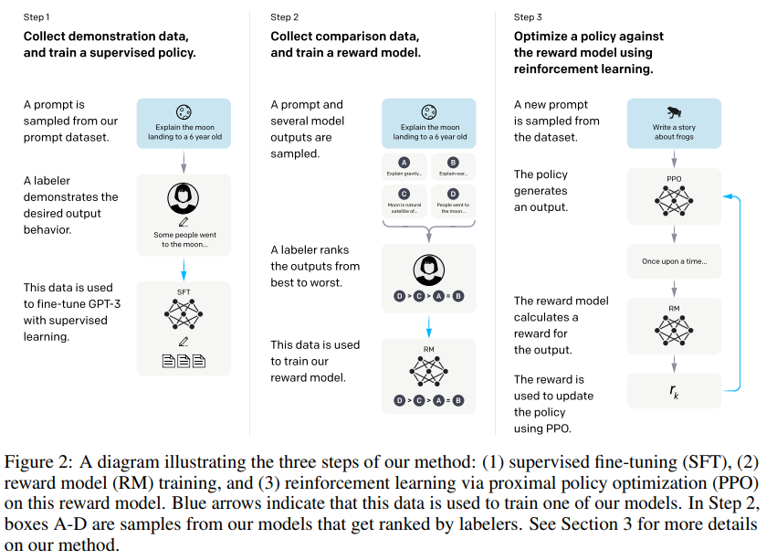
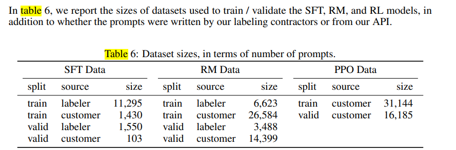
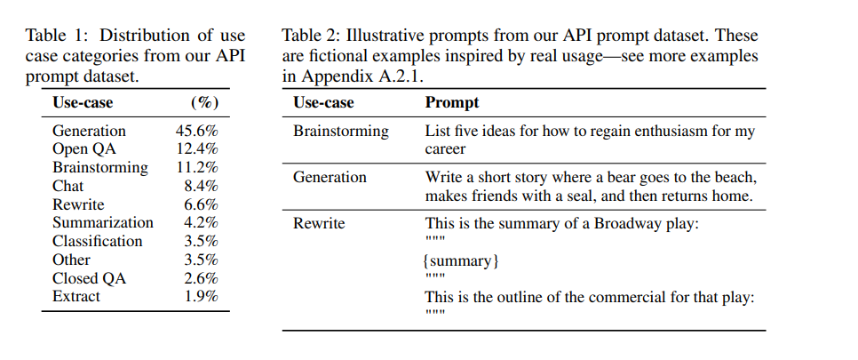

- Training language models to follow instructions with human feedback
- We call the resulting models InstructGPT
-
-
-
- 
-
- We compare GPT-3 fine-tuned on our human preference data (i.e. InstructGPT) to GPT-3 fine-tuned on two different compilations of public NLP tasks: the FLAN (Wei et al., 2021) and T0 (Sanh et al., 2021) (in particular, the T0++ variant). These datasets consist of a variety of NLP tasks, combined with natural language instructions for each task. On our API prompt distribution, our FLAN and T0
  models perform slightly worse than our SFT baseline
- 
-
- 他这个训练用的dataset中的prompt有两种来源，一个是他们的的api接口收到的用户请求，第二类是他们的labler标注的，**也就i是他们这个模型的训练是一个迭代的过程**，从用户接口收集训练数据，然后再接着投入训练，
- 
- 他这个文章里面用到的fine-tuning dataset 是人工标注生成的，和flan不一样，并没有用到那种公众的public nlp tasks dataset
- (1) a dataset of prompts written by our labelers and (2) a dataset of prompts submitted to early InstructGPT models on our API (see Table 6). These prompts are very diverse and include generation, question answering, dialog, summarization, extractions, and other natural language tasks (see Table 1).
- To produce our demonstration and comparison data, and to conduct our main evaluations, we hired
  a team of about 40 contractors on Upwork and through ScaleAI
-
-
- 这篇文章也提到了following instruction这个能力，他和FLAN那一路感觉还是不太一样，他是从human preference中去学习
-
-
-
-
-
-