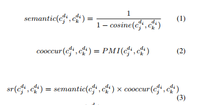
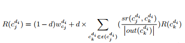
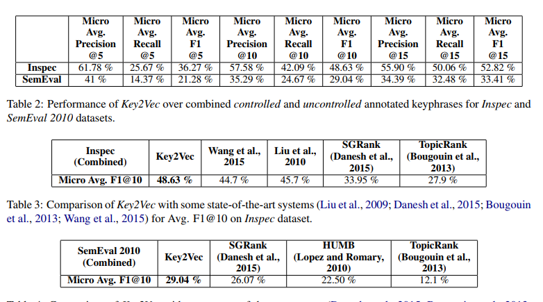

- 一般训练phrase embedding的方式可能是把各个token的embedding 相加的方式，他这篇文章里没有这样做，而是直接把每个phrase当成一个整体unit，然后用fasttext算法去训练
- 所以这个第一步就是切分出名词性短语和named entity recognition,然后自己又构造了几个规则来去除一些single word和去除noun phrases中前缀和后缀不太符合规范的token, 去除停用词等，然后基于这些处理好后的语料就可以训练词向量了
- 拿到每个phrase embedding之后，使用themed weighted pagerank算法来对每篇文章中的短语进行打分
- 这个theme weighted的意思就是每个keyphrase初始的时候赋予的分值，主要依据是他们和文章主题相关的 程度，这个的计算方式是把每个keyphrase embedding和文章主题的embedding做一个相似度计算，这个文章主题的embedding就是比如说每篇文章的题目的embedding的element wise addition作为这篇文章的主题的embedding
- 然后这个graph的构建方式还是基于关键短语之间的共现关系，在窗口内有共现关系，则有边，边的权重的计算方式依据下面三个公式
- 
-
- 然后那个pagerank的迭代公式是基于下面的公式
- 
- pagerank迭代完之后依据分值排序，取前5，10，15作为每篇文章的关键短语
- 这篇文章的验证数据集包括下面2个数据集
- The Inspec dataset is composed of 2000 abstracts of scientific articles divided into sets of 1000, 500, and 500, as training, validation and test datasets respectively. Each document has two lists of keyphrases assigned by humans - controlled, which are assigned by the authors, and uncontrolled, which are freely assigned by the readers.
- The Semeval 2010 dataset consists of 284 full length ACM articles divided into a test set of size 100, training set of size 144 and trial set of size 40. Each article has two sets of human assigned keyphrases: the author assigned and reader-assigned ones.
- 
- 感觉这个结果并不怎么样，一半的准确率都没有
-
-
-
-