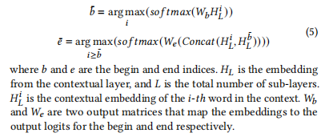

- 
- knowledge distillation loss
	- 大模型去学习小模型的softmax output
- 作者提出的这个模型的主要目的就是为了能够抽取zero-shot-extraction
- 他提出把这个bert中的知识迁移到这个属性抽取当中去，
- 他还提出了一个no answer 的分类模型
- 他这个模型的学习目标主要分为三部分，一部分是no answer的分类损失，一部分是答案标注的损失，还有一部分是迁移学习的损失
- 他这个用的标注方法是BI标注
- we make the end index prediction depend on the start index. Specifically, we concatenate the token embedding of the begin index with every token embedding after it. The new concatenated embedding is then used for finding the best end index
- 