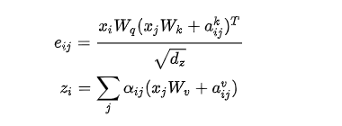
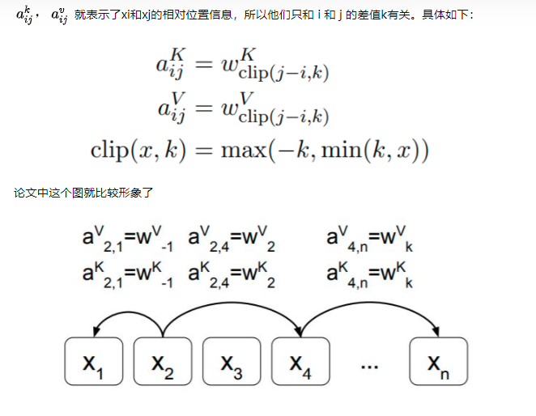
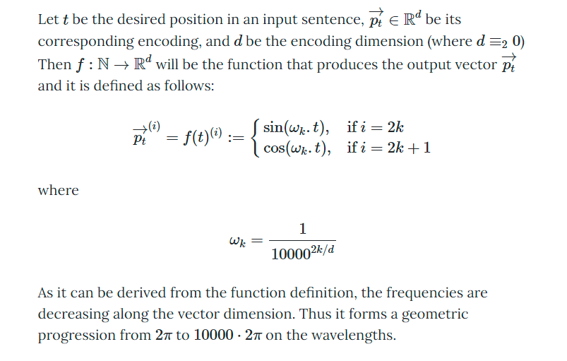
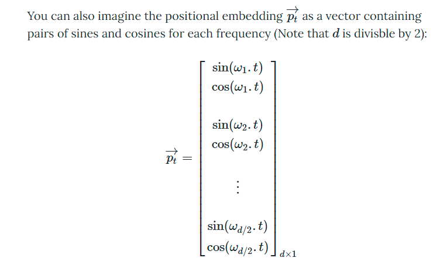
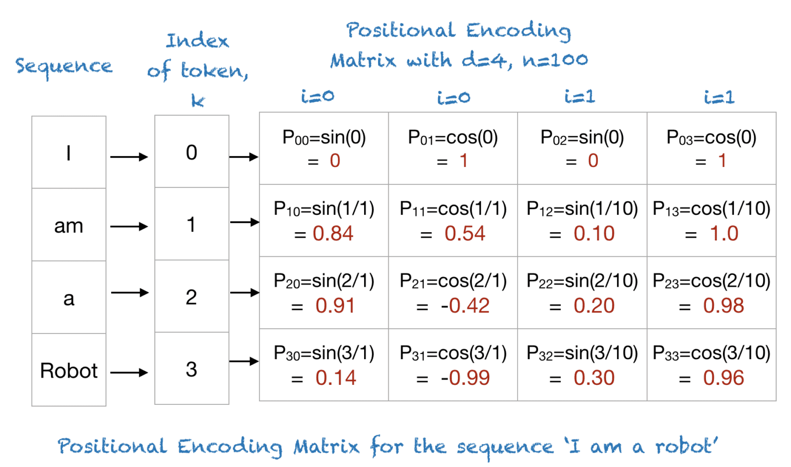

- 既然相对位置信息是在self-attention计算时候丢失的，那么最直接的想法就是在计算self-attention的时候再加回来。该工作出自Transformer的原班人马，看来Transformer提出时他们就已经发现这个问题了。
- 具体做法是在计算attention score和weighted value时各加入一个可训练的表示相对位置的参数，并且multi head之间可以共享。具体的：
- 
- 
- 作者表示，k>4以后效果就没有提升了，说明通常情况下，临域为4的窗口内(4 gram)，attention对相对位置比较敏感，窗口以外，相对位置可以不做区分。
-
  >Absolute positional encoding
- {:height 456, :width 704}
- 
- 
- https://kazemnejad.com/blog/transformer_architecture_positional_encoding/