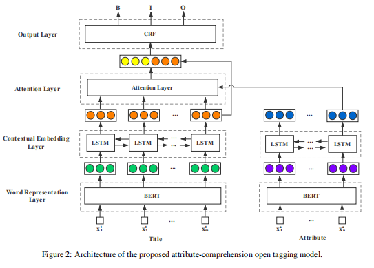

- 
- two separate lstm layer
- calculate the similarity between the attribute and each word in title to obtain attention vector S={a1,a2,a3...}
- the attribute comprehension title is C=S*H
- We concatenate the title H and attribute comprehension title C to obtain a matrix M =  [H; C], which is passed into the CRF layer to predict tag sequence
- 这篇文章中他说可以适用于attributes never seen before
  background-color:: #533e7d
- our model is able identify tokens associated with it from the title by modeling its semantic information.