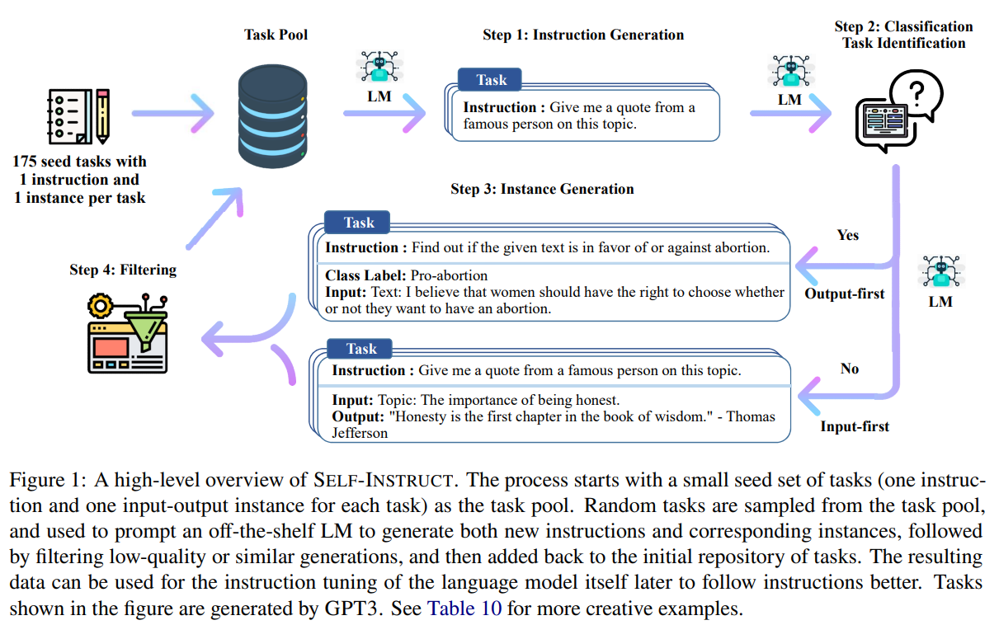
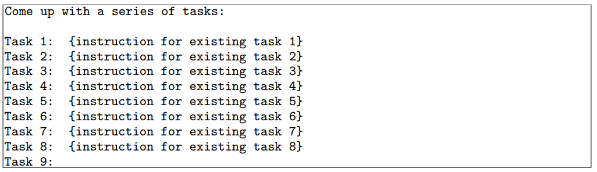
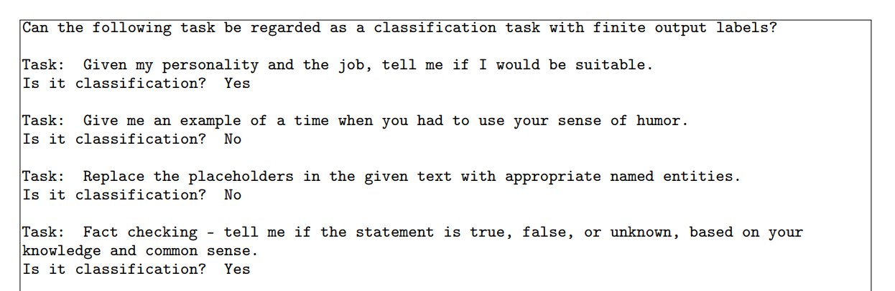
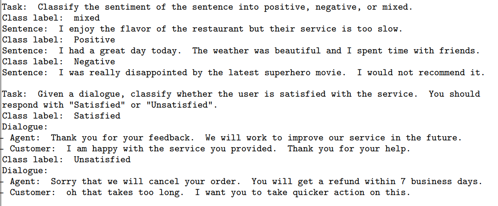

- SELF-INSTRUCT: Aligning Language Model with Self Generated Instructions
- 
- 目前已有的两个指令微调数据集
- **PROMPTSOURCE** (Bach et al., 2022) and **SUPER NATURALINSTRUCTION**S (Wang et al., 2022) are two notable recent datasets that use extensive manual annotation for collecting instructions to construct T0 (Bach et al., 2022; Sanh et al., 2022) and Tk-INSTRUCT (Wang et al., 2022).
-
-
-
-
- we introduce SELF-INSTRUCT, a semi-automated process for instruction-tuning a pretrained LM using instructional signals from the model itself
- 主要还是利用GPT3的in-context learning 能力来生成新的指令的能力
-
-
-
-
- 他这里的基础模型是指GPT3
- 首先整体说明一下该方法的流程，大致有如下几个步骤：
  background-color:: red
	- 人工设计了175个表示不同任务的指令，并且给每条数据都编写了（指令, 输入, 输出）/（指令, 输出），将这175条数据作为种子池。
	- 使用模型生成新的指令；
		- 
		- Table 6: Prompt used for generating new instructions. 8 existing instructions are randomly sampled from the task pool for in-context demonstration. The model is allowed to generate instructions for new tasks, until it stops its generation, reaches its length limit or generates “Task 16” tokens
	- 对该模型生成的指令判断是否分类任务；
		- 这里需要对新生成的指令是不是分类任务做个判断，判断的方式，也是基于GPT3 prompt的方式，做分类，至于为什么要先做个分类主要还是因为和下个步骤相关
		- 
	- 使用模型生成实例（也就是生成指令对应的输入和输出）；
		- 这里他又区分了一下输入优先生成还是输出优先生成
		- We apply the output first approach to the classification tasks identified in the former step, and the input-first approach to the remaining non-classification tasks.
		- 对于分类任务是先生成输出，再生成输入
		- 对于非分类任务 是先生成输入再生成输出
		- 、
		-
	- 对上述模型生成的数据进行过滤和后处理；
	-
	- 将经过过滤和后处理的数据添加到种子池中；
	-
	- 一直重复上述2到6步直到种子池有足够多的数据；
- 在上述步骤中有的比较简单，不再详述，下面对第2步到第5步分别详细描述。
-
-
- 这篇文章也发布了一个指令微调数据集
- We release a large synthetic dataset of 52K instructions and a set of manually-written novel tasks for building and evaluating future instruction-following models.
- We generate a total of over 52K instructions, and more than 82K instances corresponding to these instructions after filtering.
-
-
- [ChatGPT会取代搜索引擎吗 - 知乎 (zhihu.com)](https://zhuanlan.zhihu.com/p/589533490)