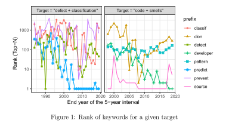

- 他这里也是做了一个基于时空划分的词的embedding的训练，以5年为一个分割
- 他这里为了确定词向量训练时需要的迭代步骤，还对词向量训练算法设计了测试用例，他这个测试用例的建立方式就是说他有一个list，里面存了一些term pair，也就是说迭代结束时，比如第一个词需要在第二个词的topk的最相近的词中，然后用这个来评价词向量训练结果的好坏，用来确定词向量训练需要的epoch，他这个是用glove算法训练的
- 这篇文章的训练数据就是软件工程领域的学术文献的标题和摘要
- 他这篇文章的真实目的是通过训练词向量来反映学术研究热点的变化，也就是trend analysis，体现这个trend的方式就是通过每个词在不同的年份区间的与该词最相近的topk的词的变化，他是以一种相对距离的方式来体现词义的变化，而不是以词的表示向量的绝对表示的变化来体现的
- 
-