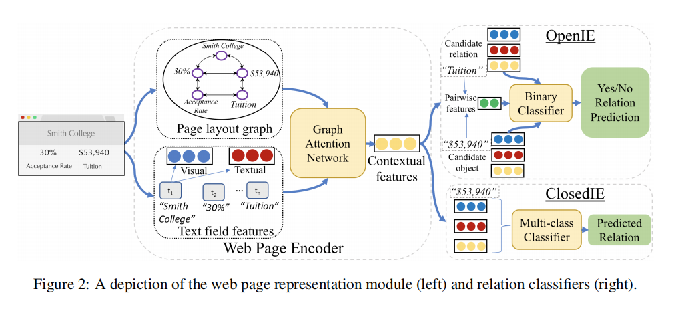
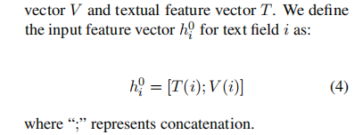
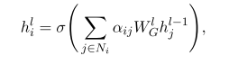
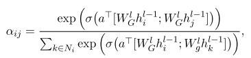

- 
- 这篇文章没有code,亚马逊的一帮人做的
- two key parts in our solution
- First, we build a graph to capture the layout relationships in a more abstract form that allows us to more easily learn the common features across different sites such as the fact that relation strings are often to the left or above their objects
-
  >Page graph construction
	- **Horizontal**: Edges are added when two text fields are horizontal neighbors on the page;
	- **Vertical**: Edges are added when two text fields are vertical neighbors on the page; that is, they have an overlapping horizontal location and there are no other text fields between them.
	- **DOM**: Edges are added when two text fields are siblings or cousins in the DOM tree;
-
  >Initial text field features
	- 
	- **Visual Features**: the height and width of the bounding box, and the font size, along with one-hot features representing the typeface, font weight, font style, color, and text alignment.
	- **Textual Features**:他这篇文章使用bert做的文本的encoder
	-
-
  >we use Graph Attention Networks (GAT)
	- 
	- 
-
  >Pre-Training Web Page Encoder
	- To encourage the GNN weights to capture the features necessary to represent relationships on the page, **we use a pre-training step to learn the GNN representation** before incorporating it into the extraction model.
-
  >Relation Extraction Model
	- Once we have the new representation hlt of each text field t produced by the above GNN process, we can perform our final classification.
		- For OpenIE, the classification decision must be made over a pair of text fields, i and j, the first containing the candidate relation string and the second containing the candidate object string.we first apply the candidate pair identification algorithm
		  from Lockard et al. (2019), which filters down to a set of potential pairs based on physical and layout distance between text fields
		- For ClosedIE, we perform a multi-class classification using the contextual representation produced by the GNN
- 他这个是基于分类的，不是基于序列标注的。
	-