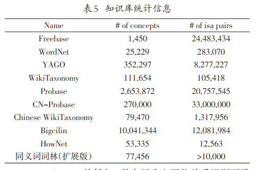

- 上下位关系抽取通常会用到的数据集
- 
- 基于知识图的资源包括
- freebase, wordnet, probase,wibi等等
- 还存在一些专门为进行上下位关系研究而构建的数据集
	- 通用领域的 Bless，entailment
	- 三个特定领域的数据集 ANIMAL, PLANT, VEHICLE
- 不过这些数据集基本是也都是基于上面的已有的知识图谱而构建的，没什么太大的新意
- 
-
-
-