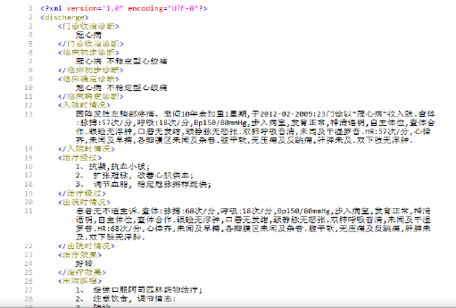

- 本研究用于构建医学知识图谱的数据主要来自于记录常识性医学知识的临床诊疗指南以及蕴含经验性医学知识的记录电子病历。这两类医学文本均采用半结构化存储格式，其中临床诊疗指南根据医
  学分类共包括 50个分册，每个分册针对常见疾病、症状诊断、鉴别诊断、检查项目、操作性治疗以及药物治疗进行了详细说明。电子病历则根据就医过程分为首次病程记录和出院小结，分别描述了患者的病情、诊断结果、治疗方案以及治疗效果
- 
- 针对临床医学指南数据，我们以疾病为单位随机选取了150份病情详解作为标注数据集。针对电子病历数据，以文档为单位随机选取了992份文档为标注数
- 本研究针对该问题提出基于递归神经网络的医学知识表示学习算法，构造以医学实体，为输入、逻辑知识为隐藏神经元的哈夫曼树状神经网络结构，在疾病诊断任务背景下训练医学知识的分布式表示，通过逐层抽象的学习过程来获得兼具深层语义信息和可解释性的向量化逻辑知识