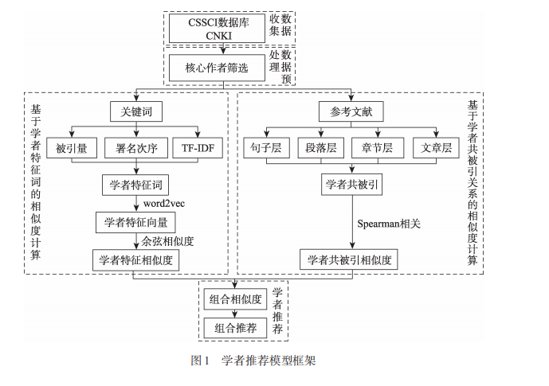
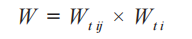
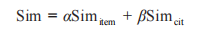

- 情报学报2021年7月
- 
- 本文构建的推荐模型核心是学者相似度的计算，学者相似度计算包括两部分，分别是基于学者
  特征词的相似度计算和基于学者共被引关系的相似度计算
- 基于学者学术成果的相似度计算
- 学者特征词选择
	- 基于计量指标的关键词权重计算:
		- 论文关键词侧重于对论文内容的高度凝练，在利用关键词对学者进行表征时，融入被引量和署名次序两个计量指标。计算得到每篇论文的每个关键词权重之后，可能会出现同一关键词出现在同一学者的不同论文中的情况，此时，将相同关键词权值进行累
		  加求和，得到各个关键词的计量权值。
	- 基于内容的学者特征词
	- 将基于计量指标计算得到的关键词权重和利用TF-IDF 算法计算得到的关键词权重按照
	- 
- 将关键词按照整合后的权重值进行排序，取排名靠前的 20 个关键词作为学者特征词。
- 基于word2vector词向量相加取平均，即可得到学者的特征向量。在得到学者特征向量之
  后，利用余弦相似度公式计算学者间的相似度，得到学者间基于特征词的相似度
- 基于学者共被引关系的相似度计算
	- 通过挖掘作者间的共被引关系，能够帮助作者找到研究方向相似的作者，从而形成学者相似度集合 B。
- 学者间基于特征词的相似度集合 A和基于共被引关系的相似度集合 B，将两种相似度以一
  定的比重相加，得到最终的学者相似度，选择最终相似度靠前的 15 位学者进行推荐
- 
-