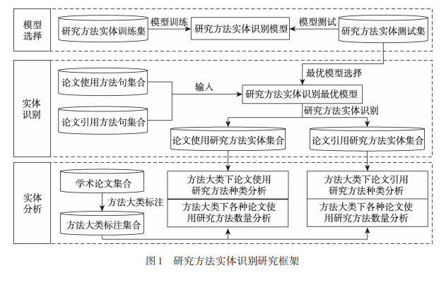
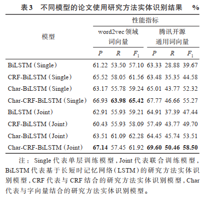
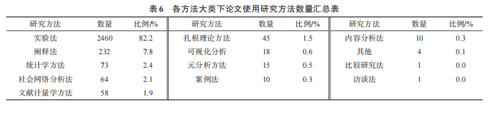

- 本文主要分析三个问题：
	- ①采用哪种深度学习神经网络模型能够在研究方法实体识别任务中得到较优的性能？
	- ②在情报学学科中，论文倾向于使用的研究方法有哪些？
	- ③在情报学学科中，被经常引用的研究方法有哪些？
-
- 这篇论文他们是自己标注了大概2000条数据集，标注的方法也是用的bilstm之类的
- 当学术文本中提及理论术语时，并不表示该学术论文使用了该理论术语，还有可能只是简单地引用该理论术语以进行比较或改进。本文将研究方法实体分为论文使用研究方法和论文引用研究方法。目前，关于研究方法的概念有两种理解：其一，关于解决应用领域问题的方法、工具、手段或技术[5-8]；其二，作者提出的问题的解决方案
- 因此，根据已有定义和研究需求，本文将论文使用研究方法定义为“解决学术文献中研究问题的方法、工具、手段、技术和方案”；另外，将论文引用研究方法定义为“被引文献中提出或使用的方法、工具、手段、技术和方案”
- 
- 
- 
- 研究方法实体识别数据集包含 2600 句论文使用方法句和 782 句论文引用方法句，数据具体标注情
  况见第 4.1.1 节。其中，一共包含 3747 个论文使用方法实体和 1244 个论文引用方法实体
-
-