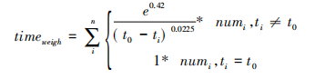
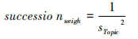
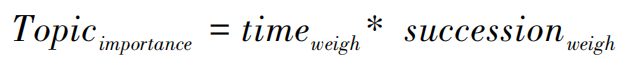
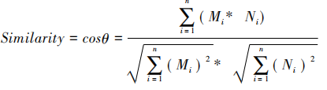

- 对于每一篇文 献将 LDA 概率最大的主题作为该文献的研究主题。 本文默认第一作者对文献的主题贡献最高，通过第一作者－文献的对应关系，将学者和主题对应起来，保留 文献的发表时间，从而得到作者的主题和时间两个维 度下的发文量分布
-
  >主题重要度计算
- 基于遗忘曲线的时间关注度计算
	- 本文采用遗忘曲线拟合学者的特定主题下的发文随时间变化的关注度，时间关注度 timeweigh 通过遗忘曲 线的内涵表示学者近期的研究成果，更能代表学者现在的研究方向和偏好
	- $time_{weigh}$ 表示的是根据年份和发文数量的加权和来表示该学者特定主题的关注度。时间距离现在越久， 关注度权重越小。
- 
- 基于发文间隔的稳定性计算
	- 如 果发文间隔期的方差越小，则稳定性更高，则稳定性指标的值更高。
	- 
- 学者主题重要度计算 本文采用时间关 注度 $time_{weight}$ 和稳定性 $succession_{weight}$ 的乘积表示学者主题重要度 Topic importance
-
- 
-
  >基于余弦相似度的学者相似度计算
- 学者相似度 Similarity 公式计算如下公式所 示，其中向量 M 和 N 表示学者的研究主题分布，向量 $M_i$ 和 $N_i$ 分别代表向量 M 和 N的分量，即各学者在主题 i 下的主题重要度。
- 
-
  >数据来源
- 本文的实验数据来源是中国知网 CSSCI 和 CSCD 核心期刊数据库，文献分类目录中勾选“图书情报与数字图书馆”，图书情报与数字图书馆领域兼顾人文社会和科学技术研究，比较有代表性，以该领域的文献和作者信息作为实验数据集验证基于时间加权 A－T 模型计算的学者相似度具有较好的适用性。
- 得到有效数据 89 177 条作为本文的实验数据，涉及 11 85 种期刊，47 206 位作者。
- 将所有文献的题名摘要作为语 料库训练 LDA 模型，根据困惑度确定最佳主题数，最终确定返回 50 个主题，依次标为主题 1、主题 2、主题 3……主题 50，并以此作为每一篇论文的标签，即该篇论文的研究主题。