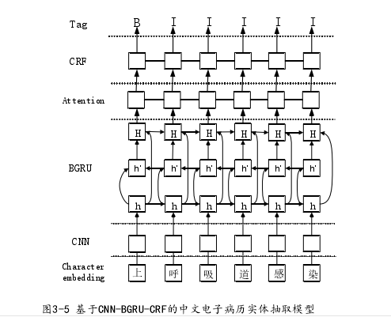
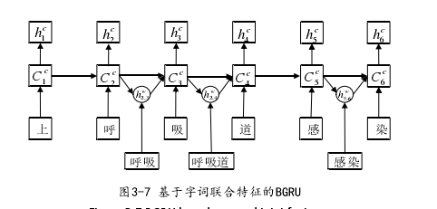

- 本章主要针对传统实体抽取方法在患者主诉信息中提取疾病症状表现不佳的问题，使用字嵌入的方法避免词嵌入方法过于依赖分词工具准确性的问题，使用卷积网络（CNN）提取出潜在词特征，使用字词联合特征的方式，通过基于注意力机制的门控循环单元（BGRU），突出症状实体的特征，最后使用条件随机场(CRF)得到最后标注，完成症状实体的抽取工作
- 模型首先通过基于字嵌入的卷积层，提取出患者主诉信息中潜在的词特征向量，然后将字词特征向量联合输入到 GRU 中进行上下文特征提取，并利用注意力机制对获取的特征进行权值分配，完成当前状态的状态更新，最后进入 CRF 层得到最后的标注结果。
- 
- 利用卷积提取局部特征的优点，提取出潜在的分词特征；BGRU 和注意力机制相结合，可以提取上下文信息，从而解决特定信息的长依赖问题；CRF 充分利用获得的信息，对标签序列进行合理性约束，得到全局最优的结果。
- 卷积层的目的是利用卷积神经网络捕捉局部特征的能力，使用卷积核在字
  符序列上滑动，提取出字序列中潜在的分词特征, 为了保持特征提取后，词特征与字符特征向量维数一致，故卷积核的宽度与字符向量维数相同
- 
- 本层是在字嵌入的基础上，引入词特征，将所有潜在的词特征嵌入到字符
  状态中，如图 3-7 所示。以“上呼吸道感染”为例，在 GRU 中更新3cC 时，不光要考虑上一状态2cC ，还要考虑潜在词汇“呼吸”所对应的隐藏状态，综合字词特征后在更新当前的字符状态3cC 。利用字词联合得方式，既避免了字嵌入方法丢失语义信息的问题又避免了词嵌入方法过度依赖分词准确性的问题，还减少了人工构造特征的工作。
- BGRU 作为 Bi LSTM 的改进版，将输入门和遗忘门合并为新的更新门，简化了模型结构，减少了模型参数，只涉及输入向量、输出隐藏向量、单元向量和门向量
- 字词特征向量在经过 BGRU 后，虽然对上下文信息进行了充分的提取，但是却无法突出其中的关键信息.对当前字词输出向量进行加权，然后将加权后的字向量和词向量归一化得到新的输出向量，以此来凸显对医疗实体有关联的信息
- 本文的数据来源于某综合性三甲医院 2017至2018年，门诊电子病历的数
  据信息。由于门诊电子病历中除了患者主诉信息外还包括了患者的个人隐私、诊断过程、治疗意见等，需要对其进行数据的清洗和脱敏处理，去除一些缺失不全的数据，将包含患者个人隐私的信息去除，只保留门诊电子病历中的主诉信息、就诊科室、就诊医生等部分。经过处理，最后得到了 92718 条实验数据,然后将实验数据的 70%作为训练数据，30%作为测试数据。
- 字向量使用文献[41]提出的训练方法，在word2vec工具上进行预训练得到，字向量维度为100。卷积层使用的是单层卷积，因此参数只考虑卷积核的大小和批训练输入大小（batch-size)，所以本文卷积核大小设置为4