- 以论文 LLaMA: Open and Efficient Foundation Language Models为例
-
- 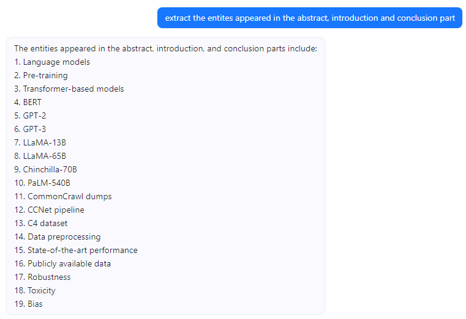
- 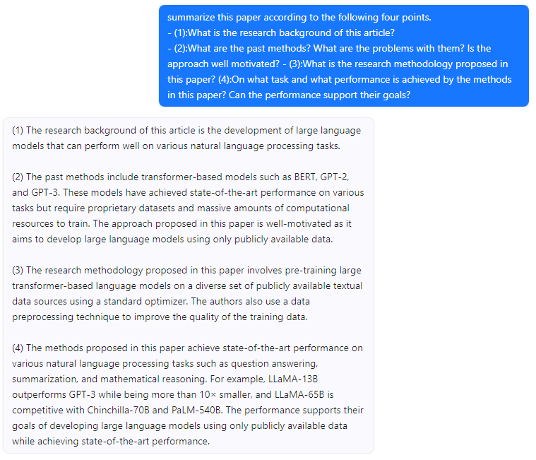
-
-
-
-
-
-
-
- 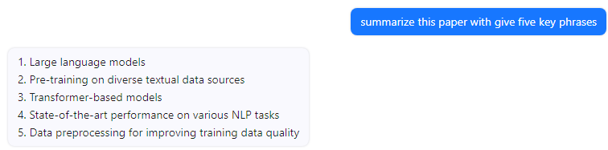
-
-
- 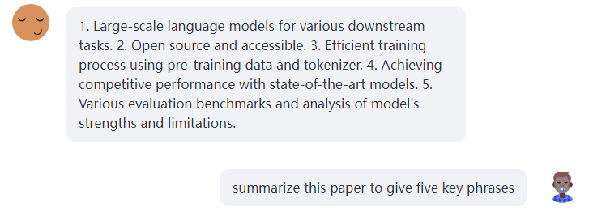
-
-
- 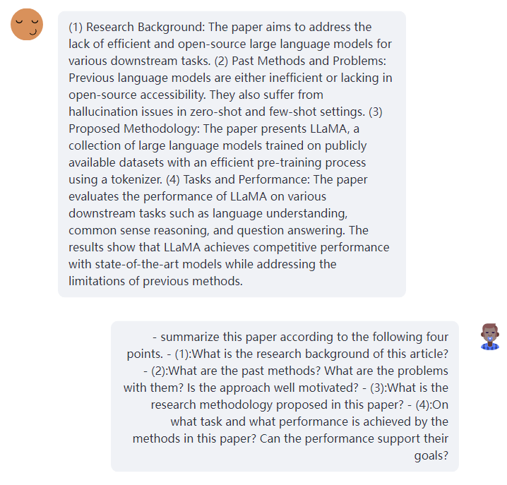
-
-
- 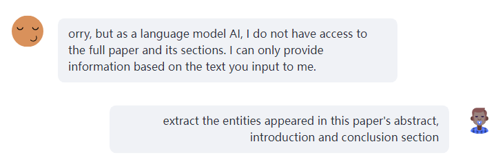
-
- 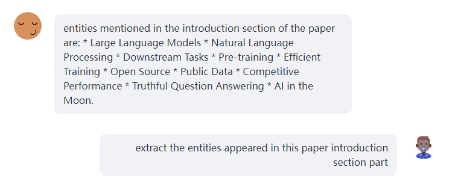
-
-
-
- 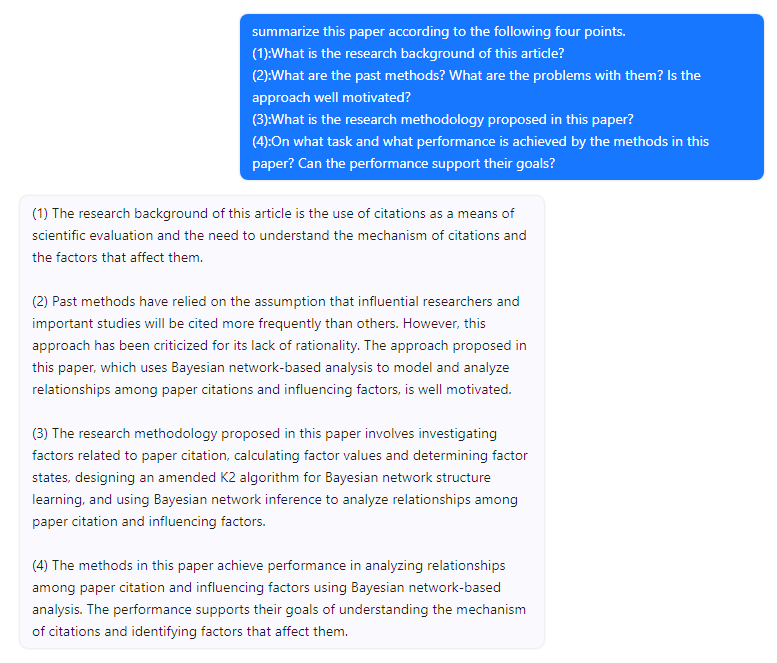
- 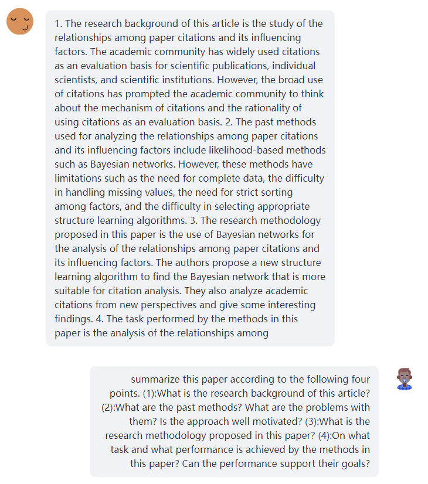
- 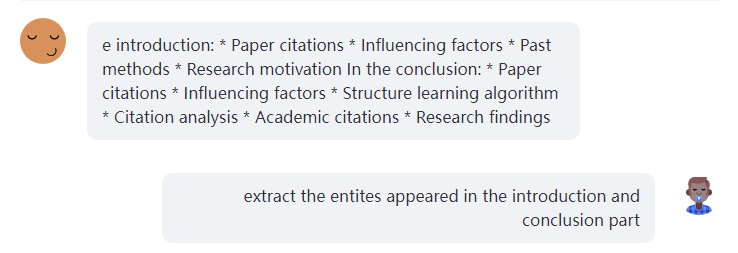
- 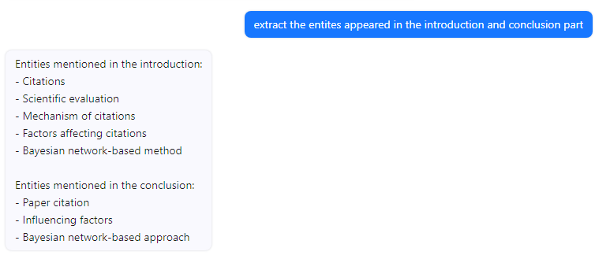
-
- 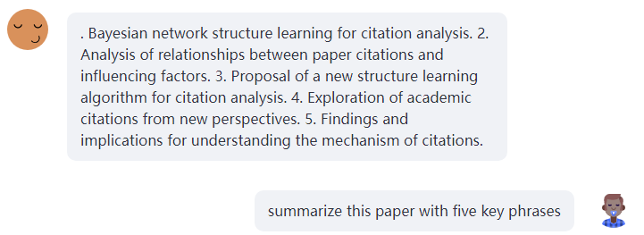
- 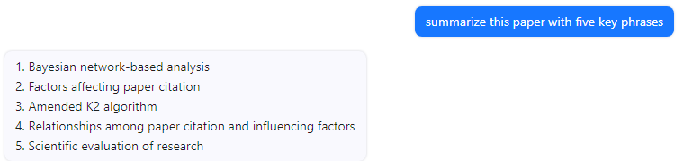
-
-
-
- summarize this paper according to the following four points.
- (1):What is the research background of this article?
- (2):What are the past methods? What are the problems with them? Is the approach well motivated?
- (3):What is the research methodology proposed in this paper?
- (4):On what task and what performance is achieved by the methods in this paper? Can the performance support their goals?
-
- 结果评估
- 根据测试的几个样本效果来看，基于开源LLM的实现的效果大部分情况下还行，对于有些提问效果容易崩坏，
-
-
-
-
-
-
-