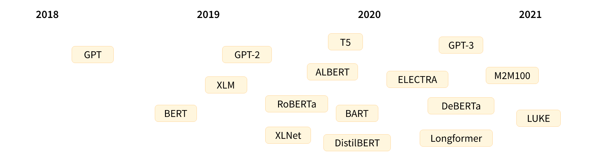
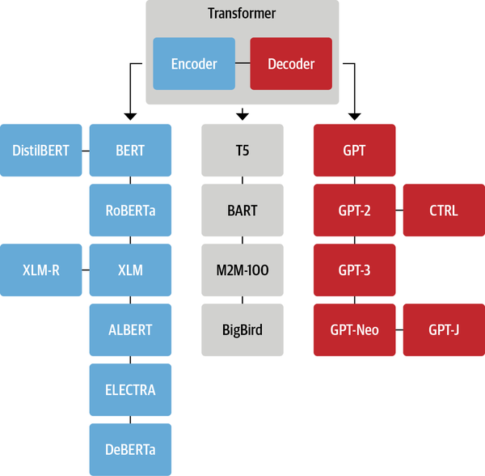

- 基于Transformer的模型中，最具代表性的是BERT和GPT2.0。其中GPT2.0是OpenAI团队升级GPT的产物；而BERT是Google团队对标GPT推出的模型，也可以视作是GPT的升级版。按照时间顺序，这些模型的发展史是这样的：（1）2018年，OpenAI基于Transformer提出了GPT；（2）2019年，Google推出了GPT的升级版BERT；（3）2019年，OpenAI推出了GPT的升级版GPT2.0。
- GPT 和 BERT 被提出之后，NLP 领域出现了越来越多基于 Transformer 结构的模型，其中比较有名有：
- 
- 两个常用的预训练任务
	- 基于句子中的前 n 个词来预测下一个词，因为输出依赖于过去和当前（而不是未来）的输入，因此该任务被称为**因果语言建模 (causal language modeling)**；
	- 基于上下文（周围的词语）来预测句子中被遮盖掉的词语 (masked word)，因此该任务被称为**遮盖语言建模 (masked language modeling)**MLM。
	- **SOP（sentence-order prediction）**任务来替代 NSP (next-sentence prediction)
	-
- 虽然新的 Transformer 模型层出不穷，它们采用不同的预训练目标在不同的数据集上进行训练，但是大致上依然可以按模型结构将它们分为三类：
	- **纯 Encoder 模型（例如 BERT）**，又被称为自编码 (auto-encoding) Transformer 模型；
	  **纯 Decoder 模型（例如 GPT）**，又被称为自回归 (auto-regressive) Transformer 模型；
	  **Encoder-Decoder 模型（例如 BART、T5）**，又被称为 Seq2Seq (sequence-to-sequence) Transformer 模型。
- 
- [[GPT-2]]
-
  >Encoder-Decoder 分支
- Encoder-Decoder 模型（又称 Seq2Seq 模型）同时使用 Transformer 架构的两个模块,这些模型可以使用编码器或解码器模型的目标来完成预训练，但通常会包含一些更复杂的任务。Encoder-Decoder 模型最适合处理那些需要根据给定输入来生成新句子的任务，例如自动摘要、翻译或生成式问答。下面我们简单介绍一些在自然语言理解 (NLU) 和自然语言生成 (NLG) 领域的 Encoder-Decoder 模型
- **[[T5]]**: T5 模型将所有 NLU 和 NLG 任务都转换为文本到文本任务来统一解决，这样就可以运用 Encoder-Decoder 框架来完成任务。例如，对于文本分类问题，将文本作为输入送入 Encoder，然后 Decoder 生成文本形式的标签。**T5 采用原始的 Transformer 架构**，在 C4 大型爬取数据集上，通过遮盖语言建模以及将所有 SuperGLUE 任务转换为文本到文本任务来进行预训练。最终，具有 110 亿个参数的最大版本 T5 模型在多个基准上取得了最优性能。
- **BART**：BART 在 Encoder-Decoder 架构中结合了 BERT 和 GPT 的预训练过程。首先将输入句子通过遮盖词语、打乱句子顺序、删除词语、文档旋转等方式进行破坏，然后通过 Encoder 编码后传递给 Decoder，并且要求 Decoder 能够重构出原始的文本。这使得模型可以灵活地用于 NLU 或 NLG 任务，并且在两者上都实现了最优性能。
- [[Big Bird: Transformers for Longer Sequences]]
-
- [[Unified Structure Generation for Universal Information Extraction]]
-
-
-
-
-
-
-
- https://xiaosheng.run/2022/04/04/transformers-biography.html