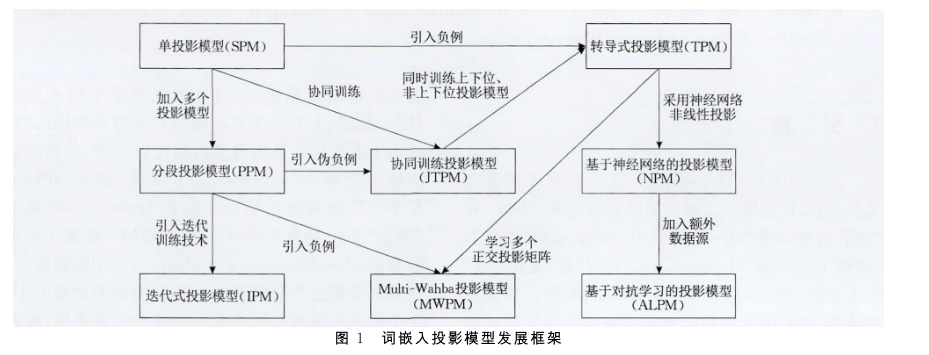
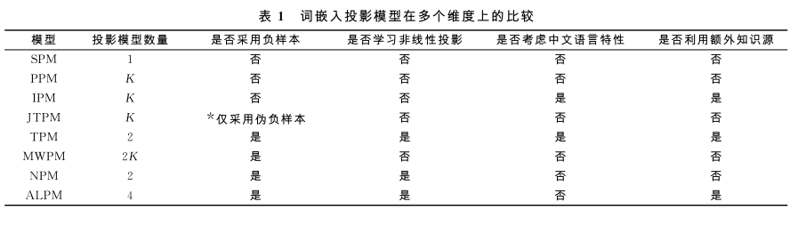

- 综述论文总结了采用词嵌入投影模型来预测上下位关系类的论文的模型
- 词嵌入投影模型学习如何将下位词的词向量投影到上位词的词向量，显式地建模了上下位关系的关系表示，就是基于这种投影关系去预测两个词之间关系是不是上下位关系
- 有线性投影的，有多个线性投影的，加偏置的，有引入非线性投影的，就是直接训练一个神经网络来学习非线性投影
- 
- {:height 207, :width 704}
- 总的来说