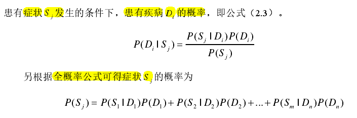
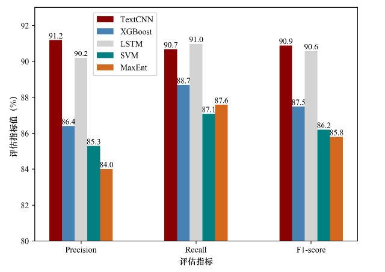

- 构建了涵盖患者主诉信息库、病症知识库及医生信息资源池的医疗垂直领域信息知识库，抽取疾病症状知识构建病症知识库，设计基于贝叶斯算法的症状权值计算方法。构建导诊推荐专用的医生信息资源池，为实现医生推荐提供数据支撑
- 
- 然后研究基于 Text CNN 算法的主诉文本多分类模型，实现了根据患者主诉进行科室的精准推荐，本文采用 Text CNN 算法利用卷积神经网络的多个不同大小的卷积核来提取主诉文本的语义特征，捕捉文本中词与词之间的局部相关性，提高文本多分类模型的泛化性能。
- 从图 3.5 中可以看出基于词级的词向量模型要比基于字符级的词向量模型更有利于文本多分类模型的泛化效果，这是因为以词作为文本信息的最小单位在语义空间中相似词之间的距离更近，而字符级建模容易丢失单词语义信息
- 
- 提出了个性化医生推荐方法，实现细粒度的医生推荐。为了达到患者找对医生、医生看对病人的目的，提出基于 Bi LSTM-CRF 算法的主诉文本病症实体识别模型，并进一步提出基于病症知识库的双向最大匹配算法对识别结果进行优化，时，为了深度挖掘患者病情诉求，研究了患者意图识别方法，有效保证了患者病症与医生擅长的精准匹配
- 分别为症状、疾病、检查和治疗四类实体
- 一方面为了解决识别模型无法识别出主诉文本中的病症实体问题设计基于病症词典的**双向最大匹配算法**
- 患者在主诉表达时往往会表述一些症状表现而非专业的疾病术语，这样识别模型则仅能识别出症状词而无法获取患者疾病，推荐系统也就无法准确的进行医生匹配，因此设计患者意图识别方法来深度挖掘患者病情诉求以确定患者所患疾病。基于病症实体识别模型抽取出患者主诉中具有的症状词，结合本文第二章构建的病症知识库，查询出该症状词所属疾病下的其他症状词返回给患者进行选择，最后通过统计计算的方法计算患者所属疾病的概率，将概率最大的疾病与医生擅长进行匹配